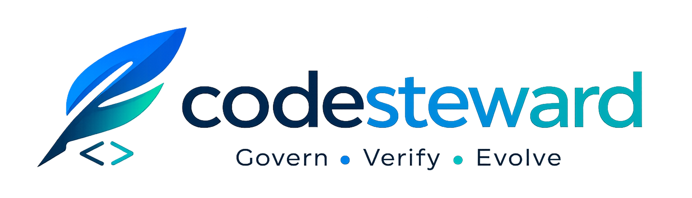

# codesteward-audit-proxy



A zero-config reverse proxy that intercepts LLM API traffic from AI coding agents and writes structured audit logs to ClickHouse.


---

## What it does

`codesteward-audit-proxy` sits between any AI coding agent (Claude Code, OpenAI Codex, Gemini CLI, Cline) and the upstream LLM API. It forwards every request and response transparently, and asynchronously extracts structured audit data — thinking blocks, assistant narration, and tool calls — into ClickHouse for later analysis.

The proxy is fully transparent. It never buffers the response before forwarding, never modifies headers or status codes, and never blocks agent operation due to audit backend failures.

---

## Features

- **Stream tap, never buffer** — uses `io.TeeReader` to forward tokens to the agent immediately while capturing a copy for audit asynchronously
- **Anthropic + OpenAI + SAP AI Core parsing** — extracts thinking blocks, text, tool calls, and token usage from both streaming (SSE) and non-streaming responses
- **Token usage tracking** — captures `input_tokens`, `output_tokens`, `cache_read_tokens`, and `cache_write_tokens` from every LLM response; stored in ClickHouse and emitted as OTel metric counters (`gen_ai.usage.input_tokens`, `gen_ai.usage.output_tokens`)
- **Request capture with scrubbing** — records user-role messages in a structured `user_messages` column; configurable regexp scrubbing replaces sensitive content with `[REDACTED]` before storage
- **IDE plugin header support** — `X-Audit-User`, `X-Audit-Team`, `X-Audit-Project`, `X-Audit-Branch`, and `X-Audit-Session-ID` headers allow IDE companion plugins to inject per-request identity and context
- **Unprocessed event capture** — responses that cannot be parsed into structured audit records (non-chat endpoints, unknown providers, parse errors) are routed to a separate `unprocessed_events` table so no data is lost
- **Health endpoint** — `GET /healthz` returns JSON status and version for IDE plugin connectivity checks and load balancer probes
- **Batched ClickHouse writes** — accumulates events in memory and flushes on size threshold (default 100) or time interval (default 1s)
- **Multi-tenancy** — `AUDIT_PROJECT` and `AUDIT_BRANCH` tag every row; `X-Audit-*` headers override env-var defaults for centrally-hosted deployments
- **OpenTelemetry traces and metrics** — one span per proxied request with `gen_ai.system`, session/turn IDs, token usage, latency, and status; `gen_ai.usage.input_tokens` and `gen_ai.usage.output_tokens` metric counters with agent/model/project dimensions; flush spans per ClickHouse batch; W3C trace context propagated in both directions
- **Proxy chaining** — supports `UPSTREAM_PROXY` for corporate firewalls, Portkey, LiteLLM, and other gateway proxies
- **Structured JSON logging** — every request, batch flush, and error logged via `log/slog`
- **Resilient by design** — ClickHouse or OTel unavailability is logged and discarded; the proxy never goes down because of a broken backend

---

## IDE Plugins

Companion plugins for VSCode and JetBrains IDEs automatically configure the proxy, inject per-request identity (`X-Audit-*` headers), and show proxy connectivity status — no manual setup required.

[](https://github.com/codesteward/codesteward-audit-proxy-plugins)
[](https://github.com/codesteward/codesteward-audit-proxy-plugins)

> **Repository:** [github.com/codesteward/codesteward-audit-proxy-plugins](https://github.com/codesteward/codesteward-audit-proxy-plugins)

---

## Architecture

```text
                        ┌──────────────────────────────┐
  Claude Code           │codesteward-audit-proxy :8080 │          Anthropic
  Codex        ──HTTP──►│                              │──HTTPS──► OpenAI
  Gemini CLI  ◄─stream──│      io.TeeReader tap        │◄─stream── Gemini
  Cline                 └──────────────┬───────────────┘
                                       │ async copy
                          ┌────────────┴────────────┐
                          │                         │
                          ▼                         ▼
                   ┌─────────────┐        ┌──────────────────┐
                   │   Batcher   │        │   OTel span      │
                   └──────┬──────┘        └────────┬─────────┘
                          │                        │
                          ▼                        ▼
                   ┌─────────────┐        ┌──────────────────┐
                   │  ClickHouse │        │  OTLP endpoint   │
                   │ audit_events│        │ (Jaeger / Tempo…)│
                   └─────────────┘        └──────────────────┘
```

---

## Quick start

**Prerequisites:** Go 1.25+, a running ClickHouse instance.

### 1. Apply the schema

```bash
clickhouse-client --multiquery < migrations/001_initial.sql
```

### 2. Start the proxy

```bash
export CLICKHOUSE_DSN=clickhouse://localhost:9000/audit
go run ./cmd/proxy
```

### 3. Point your agent at the proxy

**Claude Code:**

```bash
export ANTHROPIC_BASE_URL=http://localhost:8080
```

**OpenAI Codex CLI:**

```bash
export OPENAI_BASE_URL=http://localhost:8080/v1
```

> Codex appends `/chat/completions` directly to this base, so the `/v1` suffix is required. The preferred alternative is to set `openai_base_url` in `~/.codex/config.toml` (the env var is deprecated but still works):
>
> ```toml
> # ~/.codex/config.toml
> openai_base_url = "http://localhost:8080/v1"
> ```

**Gemini CLI:**

```bash
export GOOGLE_GEMINI_BASE_URL=http://localhost:8080
```

**Cline (VS Code extension):** — see the [Cline setup](#cline-setup) section below.

---

## Docker

The fastest way to run the proxy together with ClickHouse is via Docker Compose:

```bash
# Optional: customise project name, scrub patterns, etc.
cp .env.example .env

docker compose up -d
```

All migrations are applied automatically on the first start.
The proxy listens on `http://localhost:8080`; ClickHouse HTTP is available on `http://localhost:8123` for local inspection.

To use a pre-built image without building from source:

```bash
docker run --rm \
  -e CLICKHOUSE_DSN=clickhouse://host.docker.internal:9000/audit \
  -p 127.0.0.1:8080:8080 \
  -e PROXY_ADDR=0.0.0.0:8080 \
  ghcr.io/your-org/codesteward-audit-proxy:latest
```

---

## Cline setup

[Cline](https://github.com/cline/cline) is a VS Code extension that drives LLM APIs directly. Its base URL override is configured through the Cline settings UI — it is stored in VS Code extension storage, not in `settings.json` or an environment variable.

To route Cline traffic through the proxy:

1. Open the Cline panel in VS Code and click the **Settings** (gear) icon.
2. Set **API Provider** to **Anthropic**.
3. Enter your real Anthropic API key in the **API Key** field.
4. Enable **Use custom base URL** and set it to `http://localhost:8080`.
5. Save. All subsequent Cline requests will be intercepted and audited.

> **Note:** If the Anthropic provider does not show a base URL field in your version, switch the provider to **OpenAI Compatible**, set the base URL to `http://localhost:8080/v1`, and specify a Claude model ID (e.g. `claude-opus-4-5`) — the proxy routes OpenAI-format requests to Anthropic transparently.

---

## Configuration

All configuration is via environment variables. No config files required.

| Variable | Default | Description |
| --- | --- | --- |
| `PROXY_ADDR` | `127.0.0.1:8080` | Listen address |
| `CLICKHOUSE_DSN` | *(required)* | ClickHouse connection string |
| `CLICKHOUSE_DB` | `audit` | Database name |
| `BATCH_SIZE` | `100` | Events per flush |
| `BATCH_INTERVAL` | `1s` | Max time between flushes |
| `AUDIT_PROJECT` | `""` | Repository / project name tagged on every row |
| `AUDIT_BRANCH` | auto-detected | Git branch; falls back to `git rev-parse` at startup |
| `AUDIT_CAPTURE_REQUESTS` | `true` | When `false`, request bodies are omitted from storage (session metadata is still written) |
| `AUDIT_SCRUB_PATTERNS` | `""` | Comma-separated Go regexps; matches in request content are replaced with `[REDACTED]` |
| `ANTHROPIC_UPSTREAM_URL` | `https://api.anthropic.com` | Override Anthropic target (e.g. LiteLLM, Portkey, regional endpoint) |
| `OPENAI_UPSTREAM_URL` | `https://api.openai.com` | Override OpenAI target |
| `GEMINI_UPSTREAM_URL` | `https://generativelanguage.googleapis.com` | Override Gemini target |
| `SAP_AICORE_BASE_URL` | *(none)* | SAP AI Core API URL; enables SAP AI Core routing when set |
| `SAP_AICORE_AUTH_HOST` | `ml.hana.ondemand.com` | Host fragment for detecting SAP AI Core traffic |
| `UPSTREAM_PROXY` | *(none)* | Upstream proxy URL (overrides `HTTPS_PROXY`) |
| `LOG_LEVEL` | `info` | `debug` \| `info` \| `warn` \| `error` |
| `OTEL_EXPORTER_OTLP_ENDPOINT` | *(none)* | Activates OTel traces when set (e.g. `http://localhost:4318`) |
| `OTEL_SERVICE_NAME` | `codesteward-audit-proxy` | Service name in traces |

Standard `OTEL_EXPORTER_OTLP_HEADERS`, `OTEL_EXPORTER_OTLP_TIMEOUT`, and `OTEL_RESOURCE_ATTRIBUTES` are also honoured by the OTel SDK.

---

## Request capture and scrubbing

By default, the full request body is stored in the `raw` column and user-role message text is extracted into the `user_messages` column. Two env vars control this:

**Disable request body storage entirely:**

```bash
export AUDIT_CAPTURE_REQUESTS=false
```

Request records are still written (for session metadata and turn correlation) but `raw` is replaced with `[request capture disabled]` and `user_messages` is empty.

**Redact sensitive patterns before storage:**

```bash
export AUDIT_SCRUB_PATTERNS='[A-Za-z0-9._%+\-]+@[A-Za-z0-9.\-]+\.[A-Za-z]{2,},sk-[a-zA-Z0-9]{32,}'
```

Multiple patterns are separated by commas. Each is a standard Go regexp; any match in user message content and in the raw request body is replaced with `[REDACTED]`. The proxy refuses to start if any pattern is invalid. Response-side content is never scrubbed.

---

## OpenTelemetry

OTel is **off by default**. Set `OTEL_EXPORTER_OTLP_ENDPOINT` to enable it — no other changes required.

```bash
export OTEL_EXPORTER_OTLP_ENDPOINT=http://localhost:4318
export OTEL_SERVICE_NAME=codesteward-audit-proxy
export CLICKHOUSE_DSN=clickhouse://localhost:9000/audit
go run ./cmd/proxy
```

### What is traced

| Span | Attributes |
| --- | --- |
| `llm.proxy.request` | `gen_ai.system`, `llm.agent`, `audit.session_id`, `audit.turn_id`, `audit.project`, `audit.branch`, `http.request.method`, `url.path`, `http.response.status_code`, `gen_ai.usage.input_tokens`, `gen_ai.usage.output_tokens` |
| `audit.batch.flush` | `batch.size`, `db.system=clickhouse` |

### What is metered

| Metric | Type | Dimensions |
| --- | --- | --- |
| `gen_ai.usage.input_tokens` | Counter | `gen_ai.system`, `llm.agent`, `gen_ai.response.model`, `audit.project` |
| `gen_ai.usage.output_tokens` | Counter | `gen_ai.system`, `llm.agent`, `gen_ai.response.model`, `audit.project` |

**Span duration for `llm.proxy.request` covers the full streaming response** — from when the request is sent upstream to when the last token is delivered to the agent. This is the meaningful latency for LLM workloads.

### Trace context propagation

The proxy extracts W3C `traceparent`/`tracestate` headers from incoming agent requests (making the agent's span the parent when available) and injects them into outbound requests to the LLM API (useful when routing through an observability gateway like Portkey or Helicone).

---

## Health endpoint

`GET /healthz` returns a JSON response with the proxy status and build version:

```json
{"status": "ok", "version": "1.0.0"}
```

Useful for IDE plugin connectivity checks, load balancer probes, and deployment verification. The version is set at build time via `-ldflags "-X main.version=..."`.

---

## IDE plugin headers

When the proxy is hosted centrally (shared by a team), individual developers cannot set env vars on the proxy process. Instead, the [IDE companion plugins](https://github.com/codesteward/codesteward-audit-proxy-plugins) (VSCode, JetBrains) inject per-request identity via `X-Audit-*` headers.

| Header | Description | Override behaviour |
| --- | --- | --- |
| `X-Audit-User` | Developer identity (git email, username) | Stored as-is |
| `X-Audit-Team` | Team or org identifier | Stored as-is |
| `X-Audit-Project` | Repository / project name | Overrides `AUDIT_PROJECT` env var |
| `X-Audit-Branch` | Git branch | Overrides `AUDIT_BRANCH` env var |
| `X-Audit-Session-ID` | Session identifier | Takes priority over `X-Session-ID` and auto-generated UUID |
| `X-Audit-Agent` | Agent name override | Overrides User-Agent detection |

All `X-Audit-*` headers are stripped before forwarding to upstream APIs — they never reach the LLM provider.

---

## Multi-tenancy

`AUDIT_PROJECT` and `AUDIT_BRANCH` tag every ClickHouse row, allowing multiple repositories and branches to share one instance. For centrally-hosted proxies, `X-Audit-Project` and `X-Audit-Branch` headers override the env-var defaults on a per-request basis.

```bash
export AUDIT_PROJECT=myorg/myrepo
export AUDIT_BRANCH=feature/refactor
export CLICKHOUSE_DSN=clickhouse://localhost:9000/audit
go run ./cmd/proxy
```

Example query across tenants:

```sql
SELECT project, branch, user, agent, tool_name, count() AS calls
FROM audit.audit_events
WHERE toDate(ts) = today()
GROUP BY project, branch, user, agent, tool_name
ORDER BY calls DESC;
```

---

## Upstream routing

The proxy detects the upstream from the `Host` header first, then the request path:

| Host / Path prefix | Upstream |
| --- | --- |
| `api.anthropic.com` or `/v1/messages` | `https://api.anthropic.com` |
| `api.openai.com` or `/v1/chat/` | `https://api.openai.com` |
| `generativelanguage.googleapis.com` or `/v1beta/` | `https://generativelanguage.googleapis.com` |
| SAP AI Core host (configurable) | SAP AI Core base URL |

---

## Proxy chaining

The proxy can forward its outbound connections through an upstream proxy — useful for corporate firewalls, [Portkey](https://portkey.ai), [LiteLLM](https://litellm.ai), or [Helicone](https://helicone.ai).

```text
Agent → [codesteward-audit-proxy :8080] → [Upstream Proxy] → LLM API
```

Resolution order: `UPSTREAM_PROXY` env var → `HTTPS_PROXY`/`HTTP_PROXY` → direct. Supports `http://`, `https://`, and `socks5://` schemes.

```bash
export UPSTREAM_PROXY=http://localhost:4000
export CLICKHOUSE_DSN=clickhouse://localhost:9000/audit
go run ./cmd/proxy
```

---

## ClickHouse schema

### audit_events

One row per tool call. Responses with no tool calls produce a single row with `tool_name = ''`. Request-direction rows carry `user_messages` and have `direction = 'request'`.

```sql
CREATE TABLE audit.audit_events
(
    session_id        String,
    turn_id           String,
    ts                DateTime64(3),
    agent             LowCardinality(String),
    project           String,
    branch            LowCardinality(String),
    direction         LowCardinality(String),
    thinking          Array(String),
    assistant_text    Array(String),
    tool_name         String,
    tool_input        String,              -- JSON-encoded tool input
    model             LowCardinality(String),
    raw               String,              -- full original body (scrubbed if patterns set)
    resource_group    String,              -- SAP AI Core resource group
    request_captured  UInt8,               -- 0 when AUDIT_CAPTURE_REQUESTS=false
    user_messages     Array(String),       -- extracted user-role text, scrubbed
    user              LowCardinality(String),  -- developer identity from X-Audit-User
    team              LowCardinality(String),  -- team/org from X-Audit-Team
    input_tokens      UInt32,                  -- input/prompt tokens from LLM response
    output_tokens     UInt32,                  -- output/completion tokens from LLM response
    cache_read_tokens  UInt32,                 -- Anthropic cache read tokens
    cache_write_tokens UInt32                  -- Anthropic cache creation tokens
)
ENGINE = MergeTree()
PARTITION BY toYYYYMM(ts)
ORDER BY (project, session_id, ts);
```

### unprocessed_events

Responses (and requests) that cannot be parsed into structured audit records are stored here. This includes non-chat endpoints (e.g. `/v1/models`, `/v1/count_tokens`), unknown providers, and parse errors.

```sql
CREATE TABLE audit.unprocessed_events
(
    session_id    String,
    turn_id       String,
    ts            DateTime64(3),
    agent         LowCardinality(String),
    project       String,
    branch        LowCardinality(String),
    user          LowCardinality(String),
    team          LowCardinality(String),
    direction     LowCardinality(String),
    method        LowCardinality(String),
    path          String,
    status_code   UInt16,
    content_type  LowCardinality(String),
    raw           String,
    error         String
)
ENGINE = MergeTree()
PARTITION BY toYYYYMM(ts)
ORDER BY (project, session_id, ts);
```

### Migrations

Existing installations: apply migrations in order. If using Docker Compose, migrations are applied automatically.

```bash
clickhouse-client --multiquery < migrations/002_add_branch.sql
clickhouse-client --multiquery < migrations/003_request_capture.sql
clickhouse-client --multiquery < migrations/004_sapaicore.sql
clickhouse-client --multiquery < migrations/005_add_user_team.sql
clickhouse-client --multiquery < migrations/006_unprocessed_events.sql
clickhouse-client --multiquery < migrations/007_add_token_usage.sql
```

---

## Repository structure

```text
├── cmd/proxy/main.go                 Entry point, /healthz, wiring, graceful shutdown
├── internal/
│   ├── config/config.go              Env-var config loading, git branch detection
│   ├── telemetry/otel.go             OTel TracerProvider + MeterProvider setup (no-op when unconfigured)
│   ├── audit/
│   │   ├── event.go                  AuditEvent, UnprocessedEvent, EventAdder, UnprocessedAdder
│   │   ├── batcher.go                In-memory batchers (size + interval flush)
│   │   ├── scrubber.go               Scrubber interface, NopScrubber, PatternScrubber
│   │   └── clickhouse.go             ClickHouse native-protocol writer (audit + unprocessed)
│   ├── proxy/
│   │   ├── handler.go                Reverse proxy handler, audit transport, OTel spans
│   │   ├── router.go                 Upstream detection and URL rewriting
│   │   ├── stream.go                 TeeReader stream tap
│   │   └── transport.go              http.Transport with proxy chaining
│   └── parser/
│       ├── types.go                  Shared ToolCall, TokenUsage types
│       ├── anthropic.go              Anthropic message + SSE stream parser
│       ├── openai.go                 OpenAI chat completion + SSE stream parser
│       ├── sapaicore.go              SAP AI Core response parser
│       ├── request.go                Provider-agnostic request parser (user message extraction)
│       └── gemini.go                 Gemini stub (TODO)
├── docs/
│   ├── ide-plugins-design.md         VSCode + JetBrains companion plugin design
│   └── dashboard/                    Dashboard UI design spec and implementation guide
└── migrations/
    ├── 001_initial.sql               Full schema for new installations
    ├── 002_add_branch.sql            Add branch column
    ├── 003_request_capture.sql       Add request_captured + user_messages columns
    ├── 004_sapaicore.sql             Add resource_group column
    ├── 005_add_user_team.sql         Add user + team columns
    ├── 006_unprocessed_events.sql    Create unprocessed_events table
    ├── 007_add_token_usage.sql       Add token usage columns
    └── migrate.sh                    Idempotent HTTP migration runner
```

---

## Running tests

```bash
go test ./...
```

Tests cover: Anthropic and OpenAI parsing (full and streaming, including edge cases), batcher (size-threshold flush, ticker flush, drain on stop, non-blocking drop), scrubber (pattern redaction, multi-pattern, passthrough, invalid pattern error), request parser (string and array content, mixed conversations, scrubber application), router (host-based, path-based, header-based routing, URL rewriting), stream tap (byte fidelity, SSE detection, callback timing), and the handler end-to-end (status/body/header passthrough, internal header scrubbing, audit event emission, X-Audit-* header overrides, unprocessed event routing, agent detection for all supported agents, 502 on dead upstream).

---

## Security notes

- The proxy binds to `127.0.0.1` by default. API keys travel in plaintext on the agent→proxy leg. This is safe on localhost; for multi-host deployments, add mTLS on this leg.
- API keys in request headers (`Authorization`, `x-api-key`) are forwarded to the upstream as-is but are **never stored** in audit records.
- Use `AUDIT_SCRUB_PATTERNS` to redact emails, API keys, or other PII before any data reaches ClickHouse.
